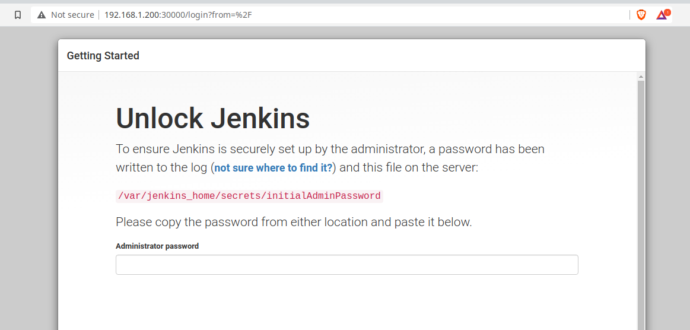
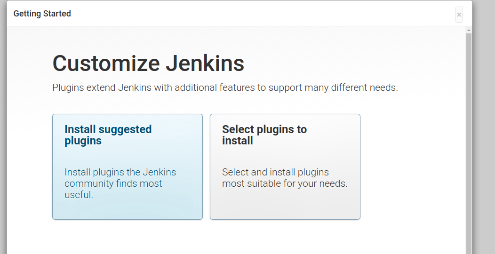
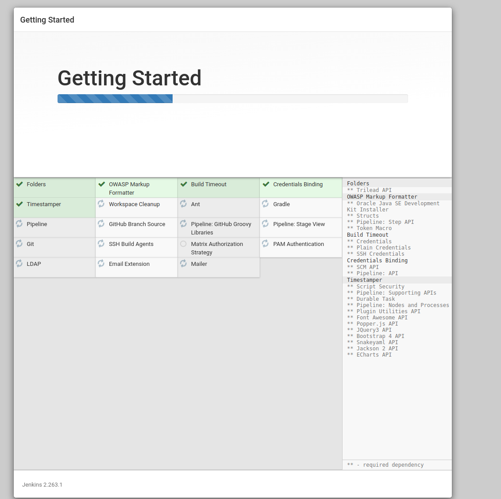
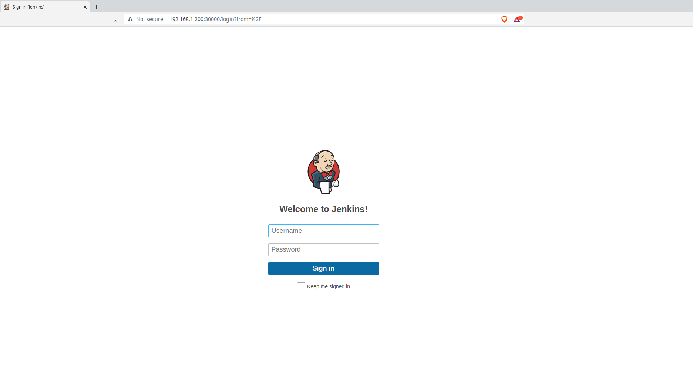

# Lab2 A Persistent Jenkins server deployed onto Kubernetes
This project will walk through how to deploy a Jenkins server that is persistent.

*Note this lab is not for production use.*

### Future Enhancements
- TLS for encryption in transit

### Lab configuration
Below you will find the specifications for the environment used to run this lab. I am confident the lab is able to run on much less hardware or even on a set of Raspberry Pi's.

#### Virtualization Environment
| Physical Server  | Hypervisor | Physical CPU | Physical Memory | Physical Storage |
| ------------- | ------------- | ------------- | ------------- | ------------- |
| Dell R420  | ProxMox Virtual Environment 6.2-4 | 8  | 32G | 2TB RAID 5 |
| Dell R420  | ProxMox Virtual Environment 6.2-4 | 24  | 32G | 4TB RAID 5 |

#### Host Machines

| Hostname  | Operating System | vCPU | Memory | Storage |
| ------------- | ------------- | ------------- | ------------- | ------------- |
| kubernetes-controller-1  | Ubuntu 20.04  | 4  | 8G | 100G |
| kubernetes-worker-1  | Ubuntu 20.04  | 2  | 4G  | 32G |
| kubernetes-worker-2  | Ubuntu 20.04  | 2  | 4G  | 32G |
| kubernetes-worker-3  | Ubuntu 20.04  | 2  | 4G  | 32G |
| nfs-server-1  | CentOS 7 | 4  | 4G  | 250G |

### Pre-requisites
- A Kubernetes cluster running v1.19.4.
  - This lab has 3 worker nodes with 4GiB memory and 2 vCPU's.
- Access to the Kubernetes cluster.
- Kubectl already configured for use.
- An already configured NFS server ready to use for persistent storage.

## Installation

It is suggested that you go through the first lab before executing this one. This lab requires that you have an NFS server to mount your persistent volume to.  

#### Jenkins Namespace

First we must create a namespace for our Jenkins server to live. Create a file called `jenkins-ns.yaml`.

```yaml
---
apiVersion: v1
kind: Namespace
metadata:
  name: jenkins
```

Then create the namespace.

```bash
$ kubectl create -f jenkins-ns.yaml
namespace/jenkins created
```

You can confirm it was created by listing the namespaces.

```bash
$ kubectl get namespaces
NAME              STATUS   AGE
default           Active   13d
jenkins           Active   28s
kube-node-lease   Active   13d
kube-public       Active   13d
kube-system       Active   13d
```

#### Persistent Volume

Next we will add a persistent volume for our Jenkins server to use. This will allow us to keep the data even if the pod is destroyed.

Like in the [NFS Lab 1](https://github.com/spensireli/lab1-kubernetes-nfs) we will create a new directory on the nfsshare called `pv0004`. This is where all the Jenkins volume will be mounted.

Create a file called `jenkins-pv.yaml` and add the following, changing the NFS server address to your NFS server.

```yaml
---
apiVersion: v1
kind: PersistentVolume
metadata:
  name: pv0004-jenkins
  namespace: jenkins
spec:
  capacity:
    storage: 20Gi
  volumeMode: Filesystem
  accessModes:
    - ReadWriteOnce
  persistentVolumeReclaimPolicy: Recycle
  storageClassName: pv0004-jenkins
  mountOptions:
    - hard
    - nfsvers=4.1
  nfs:
    path: /nfsshare/pv0004
    server: 192.168.1.195
```


Create the persistent volume.

```bash
$ kubectl create -f jenkins-pv.yaml
persistentvolume/pv0004-jenkins created
```

You can confirm that the persistent volume exists by running the following command.

```bash
$ kubectl  get pv
NAME             CAPACITY   ACCESS MODES   RECLAIM POLICY   STATUS      CLAIM   STORAGECLASS     REASON   AGE
pv0004-jenkins   20Gi       RWO            Recycle          Available           pv0004-jenkins            35s
```


#### Persistent Volume Claim

Now lets create the persistent volume claim for the jenkins volume that we have just created. Create a file called `jenkins-pvc.yaml` and add the following.

```yaml
---
apiVersion: v1
kind: PersistentVolumeClaim
metadata:
  name: pv0004-jenkins
  namespace: jenkins
spec:
  accessModes:
    - ReadWriteOnce
  storageClassName: pv0004-jenkins
  resources:
    requests:
      storage: 20Gi
```

Create the persistent volume claim.

```bash
$ kubectl create -f jenkins-pvc.yaml
persistentvolumeclaim/pv0004-jenkins created
```

You can validate that the persistent volume claim was created by running the following command.
```bash
$ kubectl get pvc -n jenkins
NAME             STATUS   VOLUME           CAPACITY   ACCESS MODES   STORAGECLASS     AGE
pv0004-jenkins   Bound    pv0004-jenkins   20Gi       RWO            pv0004-jenkins   61s
```

We can see that our persistent volume claim is bound.


#### Jenkins Service Account and Role
Now we will create the permissions for a service account that we will be using at a later date. Create a file called `jenkins-sa.yaml` and add the following.

```yaml
---
  apiVersion: v1
  kind: ServiceAccount
  metadata:
    name: jenkins
    namespace: jenkins
---
  apiVersion: rbac.authorization.k8s.io/v1
  kind: ClusterRole
  metadata:
    annotations:
      rbac.authorization.kubernetes.io/autoupdate: "true"
    labels:
      kubernetes.io/bootstrapping: rbac-defaults
    name: jenkins
    namespace: jenkins
  rules:
  - apiGroups:
    - '*'
    resources:
    - statefulsets
    - services
    - replicationcontrollers
    - replicasets
    - podtemplates
    - podsecuritypolicies
    - pods
    - pods/log
    - pods/exec
    - podpreset
    - poddisruptionbudget
    - persistentvolumes
    - persistentvolumeclaims
    - jobs
    - endpoints
    - deployments
    - deployments/scale
    - daemonsets
    - cronjobs
    - configmaps
    - namespaces
    - events
    - secrets
    verbs:
    - create
    - get
    - watch
    - delete
    - list
    - patch
    - apply
    - update
    - apiGroups:
    - ""
    resources:
    - nodes
    verbs:
    - get
    - list
    - watch
    - update
---
  apiVersion: rbac.authorization.k8s.io/v1
  kind: ClusterRoleBinding
  metadata:
    annotations:
      rbac.authorization.kubernetes.io/autoupdate: "true"
    labels:
      kubernetes.io/bootstrapping: rbac-defaults
    name: jenkins
    namespace: jenkins
  roleRef:
    apiGroup: rbac.authorization.k8s.io
    kind: ClusterRole
    name: jenkins
  subjects:
  - apiGroup: rbac.authorization.k8s.io
    kind: Group
    name: system:serviceaccounts:jenkins
```

Create the service account and role by running the following command.
```bash
$ kubectl create -f jenkins-sa.yaml
serviceaccount/jenkins created
clusterrole.rbac.authorization.k8s.io/jenkins created
clusterrolebinding.rbac.authorization.k8s.io/jenkins created
```

You can confirm that the service account was created by running the following command.

```bash
$ kubectl -n jenkins get sa
NAME      SECRETS   AGE
default   1         8m18s
jenkins   1         89s
```


#### Jenkins Deployment

Once we have the persistent volume and claim created we can now deploy the container.

What we are doing is configuring a container with a single replica with a label `jenkins`.

This is going to be deployed to the `jenkins` namespace that we first created. We are running the container on port `8080` and `50000`. The important component here for persistent data between deletion is the `volumeMounts`.

You may note that we have defined our volume mount as `jenkins-pv-storage` which it gets from the `volumes` section. The `volumes` section declares this as the persistent volume claim we created earlier called `pv0004-jenkins`.

This volume is mounted inside the container to `/var/jenkins_home`.

Create a file called `jenkins-deployment.yaml` and add the following.


```yaml
---
apiVersion: apps/v1
kind: Deployment
metadata:
  name: jenkins
  namespace: jenkins
spec:
  replicas: 1
  selector:
    matchLabels:
      app: jenkins
  template:
    metadata:
      labels:
        app: jenkins
        namespace: jenkins
    spec:
      containers:
      - name: jenkins
        image: jenkins/jenkins:lts
        ports:
          - name: http-port
            containerPort: 8080
          - name: jnlp-port
            containerPort: 50000
        volumeMounts:
          - name: jenkins-pv-storage
            mountPath: /var/jenkins_home
      volumes:
        - name: jenkins-pv-storage
          persistentVolumeClaim:
            claimName: pv0004-jenkins
```

Deploy the jenkins container.

```bash
$ kubectl create -f jenkins-deployment.yaml
deployment.apps/jenkins created
```

You can confirm that it has been created by running the following commands.
```bash
$ kubectl -n jenkins get pods -o wide
NAME                     READY   STATUS    RESTARTS   AGE   IP           NODE                  NOMINATED NODE   READINESS GATES
jenkins-6ff8d69b-7rl9d   1/1     Running   0          56s   10.244.1.9   kubernetes-worker-1   <none>           <none>
```


#### Jenkins Service

Here we are creating two services to expose the container ports that we declared in the deployment. We declare the port that the service is running on in the container `8080` and what we would like it to be broadcast as on the hosts `nodePort` which is port `30000`.

We are doing the same thing for the service `jenkins-jnlp` however not exposing the port to the node.

Create a file called `jenkins-svc.yaml` and add the following.

```yaml
---
apiVersion: v1
kind: Service
metadata:
  name: jenkins
  namespace: jenkins
spec:
  type: NodePort
  ports:
    - port: 8080
      targetPort: 8080
      nodePort: 30000
  selector:
    app: jenkins

---
apiVersion: v1
kind: Service
metadata:
  name: jenkins-jnlp
  namespace: jenkins
spec:
  type: ClusterIP
  ports:
    - port: 50000
      targetPort: 50000
  selector:
    app: jenkins
```

Create the service by running the following commands.

```bash
$ kubectl create -f jenkins-svc.yaml
service/jenkins created
service/jenkins-jnlp created
```

You can confirm the services exist by running the following commands.

```bash
$ kubectl -n jenkins get services
NAME           TYPE        CLUSTER-IP       EXTERNAL-IP   PORT(S)          AGE
jenkins        NodePort    10.100.195.191   <none>        8080:30000/TCP   8s
jenkins-jnlp   ClusterIP   10.111.149.244   <none>        50000/TCP        8s
```
#### Accessing The Jenkins Server
You can now access the jenkins server by connecting to port `30000` of the IP address of the worker node that the container lives.

To get the node that the container lives on run the following command.

```bash
$ kubectl -n jenkins get pods -o wide
NAME                     READY   STATUS    RESTARTS   AGE     IP           NODE                  NOMINATED NODE   READINESS GATES
jenkins-6ff8d69b-7rl9d   1/1     Running   0          5m14s   10.244.1.9   kubernetes-worker-1   <none>           <none>
```

We can see that the node name is `kubernetes-worker-1`.

Now run the following command to get details about the node.

```bash
$ kubectl get node kubernetes-worker-1 -o wide
NAME                  STATUS   ROLES    AGE   VERSION   INTERNAL-IP     EXTERNAL-IP   OS-IMAGE           KERNEL-VERSION     CONTAINER-RUNTIME
kubernetes-worker-1   Ready    <none>   13d   v1.19.3   192.168.1.200   <none>        Ubuntu 20.04 LTS   5.4.0-53-generic   docker://19.3.8
```

Open your web browser and navigate to the address and port `30000`. For example `http://192.168.1.200:30000`.

You will be prompted with the following screen if it is your first time logging in.



We will need to connect to the container to get the initial administrator password. We can do this by running the following commands against your pod.

```bash
$ kubectl -n jenkins exec -it jenkins-6ff8d69b-7rl9d bash
kubectl exec [POD] [COMMAND] is DEPRECATED and will be removed in a future version. Use kubectl kubectl exec [POD] -- [COMMAND] instead.
jenkins@jenkins-6ff8d69b-7rl9d:/$ cat /var/jenkins_home/secrets/initialAdminPassword
```

This will return a long string which is the initial administrator password. Paste this password into the browser screen.

Choose `Install Suggested Plugins`.



It will install default plugins that are useful once completed it will ask you to create a username and password, enter the necessary fields and then click "Save and Continue".



Congratulations you are all configured ! You can verify that your persistent volume is operating as expected by performing the next section.

#### Persistence Validation

We will delete the Jenkins pod to verify that our volume is truly persistent.

First lets get the pod.
```bash
$ kubectl -n jenkins get pods
NAME                     READY   STATUS    RESTARTS   AGE
jenkins-6ff8d69b-7rl9d   1/1     Running   0          19m
```

Now lets delete the pod.
```bash
$ kubectl -n jenkins delete pod jenkins-6ff8d69b-7rl9d
pod "jenkins-6ff8d69b-7rl9d" deleted
```

The pod will restart but note that the pod name is different.
```bash
$ kubectl -n jenkins get pods
NAME                     READY   STATUS    RESTARTS   AGE
jenkins-6ff8d69b-4bp2p   1/1     Running   0          25s
```

This means that this is a whole new container that has been deployed but the data is carried between the old pod and the new pod through the volume.

Validate that you are able to access the UI and login by navigating to the IP address of the node it lives on and the appropraite port `30000`.




### Uninstall

To uninstall execute the following commands.

```bash
$ kubectl delete -f jenkins-svc.yaml
service "jenkins" deleted
service "jenkins-jnlp" deleted
$ kubectl delete -f jenkins-deployment.yaml
deployment.apps "jenkins" deleted
$ kubectl delete -f jenkins-sa.yaml
serviceaccount "jenkins" deleted
clusterrole.rbac.authorization.k8s.io "jenkins" deleted
clusterrolebinding.rbac.authorization.k8s.io "jenkins" deleted
$ kubectl delete -f jenkins-pvc.yaml
persistentvolumeclaim "pv0004-jenkins" deleted
$ kubectl delete -f jenkins-pv.yaml
persistentvolume "pv0004-jenkins" deleted
$ kubectl delete -f jenkins-ns.yaml
namespace "jenkins" deleted
```
